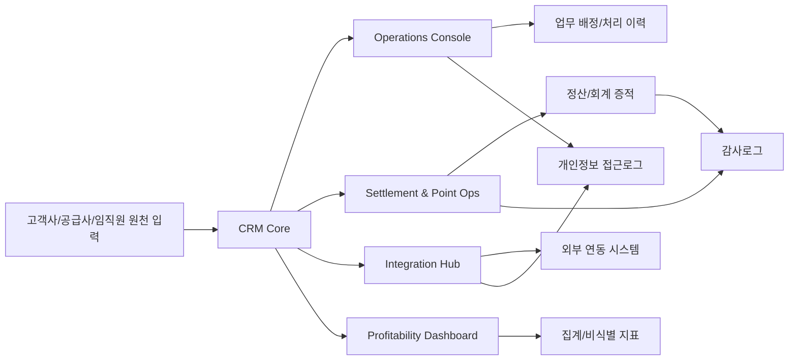

# A7 보안/컴플라이언스 초안

## 1. 문서 목적

이 문서는 이제너두 전사 CRM OS MVP의 Security & Audit Baseline을 구체화하기 위한 A7 보안/컴플라이언스 초안이다. RBAC, 테넌트 격리, 개인정보 접근로그, 감사로그, 보존정책, 개인정보 흐름도, 위험-통제 매핑을 MVP 기본 요구로 정의한다.

본 문서는 확정안이 아니며, 개인정보/민감정보 항목, 처리범위, 보관기간, 위탁/재위탁, 예산, 외부계약, 아키텍처 확정은 PM 김권일 승인 전 확정하지 않는다.

인당 생산성/마진 기여: 보안과 감사 요구를 MVP에 내재화해 사후 보완, 감사 대응, 장애성 권한 정리 비용을 줄인다.

## 2. 기준 입력

| 입력 | 내용 | 상태 |
|---|---|---|
| PRD | `/docs/PRD.md`의 Security & Audit Baseline, 비기능 요구사항, 리스크 및 PM 승인 항목 | 확인 |
| 회사 컨텍스트 | 선택적복지 B2E 플랫폼, 고객사 약 2,800개, 임직원 약 260만 명 이상 | 확인 |
| 필수 통제 | ISMS, 개인정보 및 민감정보 보호, 외감 회계 대응 | 확인 |
| 미확정 정보 | 개인정보/민감정보 항목, 외부 연동 상세, 위탁/재위탁, 보관기간 | PM 승인 필요 |

인당 생산성/마진 기여: 입력과 미확정 항목을 분리해 추정 기반 개발과 재작업을 줄인다.

## 3. 출력/산출물

| 산출물 | 용도 |
|---|---|
| `/docs/SECURITY_A7_DRAFT.md` | 경영진/PM/에이전트 공유용 보안·컴플라이언스 요구 초안 |
| `/specs/security/compliance-baseline.md` | 구현/검증 기준으로 사용할 보안·감사 베이스라인 스펙 |

인당 생산성/마진 기여: 공유 문서와 구현 스펙을 분리해 의사결정과 개발 검증의 왕복 비용을 줄인다.

## 4. 범위

### 포함

- RBAC 역할, 권한, 승인 흐름 초안
- 고객사/공급사/임직원 기준 테넌트 격리 원칙
- 개인정보 접근로그와 감사로그 대상 이벤트 초안
- 로그 보존, 파기, 증적 제출 정책 초안
- 개인정보 흐름도 초안
- ISMS, 개인정보 보호, 외감 대응 중심 위험-통제 매핑

### 제외

- 개인정보/민감정보 항목 확정: PM 승인 필요
- 개인정보 처리범위 및 보관기간 확정: PM 승인 필요
- 외부 SaaS, 보안 솔루션, 컨설팅 계약 확정: PM 승인 필요
- 데이터베이스/인프라 아키텍처 확정: PM 승인 필요
- AI 자동 의사결정의 무검토 운영 확정: PM 승인 필요

인당 생산성/마진 기여: MVP 보안 범위를 통제 가능한 기본선으로 제한해 초기 구축비와 승인 리스크를 줄인다.

## 5. 담당

| 역할 | 담당 |
|---|---|
| 총괄 승인 | PM 김권일 |
| 보안/컴플라이언스 초안 | A7 |
| CRM Core 연계 | A1 |
| Operations Console 연계 | A2 |
| 정산/외감 연계 | A4, A6 |
| QA/통제 검증 연계 | A9 |

인당 생산성/마진 기여: 책임 경계를 명확히 해 보안 요구 누락과 중복 검토 시간을 줄인다.

## 6. 핵심 보안 결정 초안

### D1. RBAC를 MVP 기본 권한 모델로 둔다

- 모든 사용자는 하나 이상의 역할을 가진다.
- 역할은 최소권한 원칙으로 권한을 부여한다.
- 민감 작업은 단일 권한이 아니라 역할, 테넌트 범위, 승인 상태, 업무 목적을 함께 평가한다.
- 권한 변경은 승인 이벤트와 감사로그를 남긴다.

인당 생산성/마진 기여: 권한 요청과 수동 확인을 표준화해 운영 지연과 보안 사고 대응 비용을 줄인다.

### D2. 테넌트 격리는 조회와 변경 모두에 적용한다

- 고객사, 공급사, 임직원, 계약, 포인트, 정산, CS 데이터는 테넌트 범위 조건을 기본 적용한다.
- 운영자 권한도 담당 범위 또는 승인된 업무 범위 안에서만 확장한다.
- 전사 관리자 권한은 break-glass와 상시 관리자 권한을 분리한다.
- 테넌트 우회 접근은 예외 접근으로 기록한다.

인당 생산성/마진 기여: 고객사 간 데이터 노출 사고 가능성을 낮춰 신뢰 손실과 보상 비용을 예방한다.

### D3. 개인정보 접근로그는 조회 행위까지 남긴다

- 개인정보 상세 조회, 검색 결과 노출, 다운로드, 내보내기, 마스킹 해제, 권한 상승 접근을 기록한다.
- 접근로그는 사용자, 역할, 테넌트, 대상 엔티티, 목적, 시각, IP/디바이스, 결과를 포함한다.
- 민감정보 항목과 마스킹 해제 기준은 PM 승인 필요로 둔다.

인당 생산성/마진 기여: 사후 조사 시간을 줄이고 불필요한 개인정보 조회를 억제해 규제 대응 비용을 낮춘다.

### D4. 감사로그는 업무 변경과 승인 근거를 중심으로 남긴다

- 계약, 포인트, 정산, 지급/차감, 승인/반려, 예외 처리, 권한 변경, 외부 연동 재처리 이벤트를 감사로그 대상으로 둔다.
- 감사로그는 변경 전/후 값, 변경 주체, 승인자, 사유, 관련 티켓 또는 업무 ID를 포함한다.
- 외감 대응 대상 이벤트의 상세 범위는 재무/정산 에이전트와 PM 승인 필요로 둔다.

인당 생산성/마진 기여: 외감 자료 수집과 수기 증적 정리 시간을 줄여 재무/운영 인력 투입을 낮춘다.

### D5. 보존정책은 최소 보존과 감사 대응을 균형으로 설계한다

- 개인정보 원본, 개인정보 접근로그, 감사로그, 정산/회계 증적은 보존 목적과 기간을 분리한다.
- 법정/계약/외감 보존기간이 확인되지 않은 항목은 PM 승인 필요로 표시한다.
- 보존기간 만료 데이터는 파기, 비식별화, 아카이브 중 하나의 정책을 적용한다.

인당 생산성/마진 기여: 과도한 저장 비용과 불필요한 개인정보 보유 리스크를 줄인다.

## 7. RBAC 초안

| 역할 | 주요 권한 | 제한 | 승인 상태 |
|---|---|---|---|
| `ExecutiveViewer` | 수익성/생산성 지표 조회 | 개인정보 상세 조회 불가 기본 | PM 승인 필요 |
| `SalesAM` | 담당 고객사, 계약, 활동 이력 조회/수정 | 담당 고객사 범위 제한 | 초안 |
| `OpsAgent` | 운영 업무 큐 처리, 상태 변경 | 개인정보 상세는 업무 배정 범위 제한 | 초안 |
| `SettlementOperator` | 포인트/정산 상태 처리, 예외 큐 관리 | 회계 증적 삭제 불가 | 초안 |
| `FinanceAuditor` | 정산/회계 증적 조회, 감사 리포트 추출 | 운영 데이터 변경 불가 | 초안 |
| `SecurityPrivacyOfficer` | 접근로그/감사로그 조회, 권한 검토 | 업무 데이터 변경 불가 기본 | 초안 |
| `SupplierUser` | 소속 공급사 상품/정산 상태 조회 | 타 공급사 접근 불가 | PM 승인 필요 |
| `CustomerAdmin` | 소속 고객사 임직원/계약 상태 조회 | 타 고객사 접근 불가 | PM 승인 필요 |
| `SystemAdmin` | 시스템 설정, 장애 대응 | 개인정보 상시 접근 불가 | 초안 |
| `BreakGlassAdmin` | 긴급 장애/보안 사고 대응 접근 | 사유, 승인, 사후 검토 필수 | PM 승인 필요 |

인당 생산성/마진 기여: 역할별 업무 범위를 고정해 온보딩, 권한 검토, 장애 대응 시간을 줄인다.

## 8. 테넌트 격리 초안

| 데이터 영역 | 기본 격리 키 | 접근 원칙 | 예외 |
|---|---|---|---|
| 고객사 | `customer_company_id` | 고객사별 데이터 분리 | 전사 운영 승인 접근 |
| 공급사 | `supplier_id` | 공급사별 데이터 분리 | 정산/계약 담당 승인 접근 |
| 임직원 | `employee_id`, `customer_company_id` | 소속 고객사 기준 분리 | 개인정보 업무 배정 접근 |
| 계약 | `contract_id`, `customer_company_id`, `supplier_id` | 계약 당사자와 담당자 기준 | 법무/재무 승인 접근 |
| 포인트/정산 | `settlement_id`, `customer_company_id`, `supplier_id` | 정산 담당 범위 기준 | 외감 증적 조회 |
| CS/운영 업무 | `case_id`, `tenant_scope` | 배정자/담당조직 기준 | SLA 장애 대응 |

인당 생산성/마진 기여: 데이터 접근 기준을 엔티티별로 고정해 화면과 API별 중복 권한 설계를 줄인다.

## 9. 개인정보 접근로그 초안

### 기록 대상

- 개인정보 상세 조회
- 개인정보 검색 결과 노출
- 다운로드, CSV/Excel 반출, API 반출
- 마스킹 해제
- 개인정보 수정, 삭제, 복구
- 권한 상승 또는 break-glass 접근
- 외부 연동으로 개인정보가 전송되는 이벤트

### 필수 필드

| 필드 | 설명 |
|---|---|
| `event_id` | 접근 이벤트 고유 ID |
| `event_time` | 접근 시각 |
| `actor_user_id` | 접근자 ID |
| `actor_role` | 접근자 역할 |
| `tenant_scope` | 접근 테넌트 범위 |
| `target_entity_type` | 대상 엔티티 유형 |
| `target_entity_id` | 대상 엔티티 ID |
| `access_purpose` | 업무 목적 |
| `action` | 조회, 수정, 다운로드, 마스킹 해제 등 |
| `result` | 성공, 실패, 거부 |
| `ip_address` | 접근 IP |
| `device_id` | 디바이스 식별자 또는 세션 식별자 |
| `approval_id` | 승인 기반 접근인 경우 승인 ID |

민감정보 대상 필드와 마스킹 기준: PM 승인 필요.

인당 생산성/마진 기여: 접근 이벤트 표준화로 감사 조회 자동화와 이상 접근 탐지 기반을 만든다.

## 10. 감사로그 초안

### 기록 대상

- 고객사/공급사/임직원/계약 핵심 정보 생성, 변경, 삭제
- 포인트 지급, 차감, 보정, 취소
- 정산 확정, 보류, 반려, 재처리
- 운영 업무 상태 변경, 배정, SLA 예외
- 승인, 반려, 권한 변경
- 외부 연동 요청, 실패, 재시도, 수동 보정
- 로그 설정 변경, 보존정책 변경

### 필수 필드

| 필드 | 설명 |
|---|---|
| `audit_id` | 감사 이벤트 고유 ID |
| `event_time` | 이벤트 발생 시각 |
| `actor_user_id` | 행위자 ID |
| `actor_role` | 행위자 역할 |
| `tenant_scope` | 대상 테넌트 범위 |
| `domain` | CRM, Ops, Settlement, Integration, Security 등 |
| `object_type` | 변경 대상 유형 |
| `object_id` | 변경 대상 ID |
| `action` | 생성, 변경, 삭제, 승인, 반려 등 |
| `before_hash` | 변경 전 데이터 해시 또는 참조 |
| `after_hash` | 변경 후 데이터 해시 또는 참조 |
| `reason` | 변경 사유 |
| `approval_id` | 승인 ID |
| `case_id` | 관련 업무/티켓 ID |

인당 생산성/마진 기여: 변경 근거를 자동 축적해 외감·분쟁 대응에 필요한 수작업 증적 수집을 줄인다.

## 11. 보존정책 초안

| 데이터 | 보존 원칙 | 기본 정책 | 상태 |
|---|---|---|---|
| 개인정보 원본 | 목적 달성 후 최소 보관 | 업무 목적별 보관기간 분리 | PM 승인 필요 |
| 민감정보 원본 | 엄격한 최소 보관 | 수집/처리 여부부터 검토 | PM 승인 필요 |
| 개인정보 접근로그 | 규제 대응과 이상 접근 조사 목적 | 별도 보존, 위변조 방지 | PM 승인 필요 |
| 감사로그 | 외감/분쟁/승인 증적 목적 | 장기 보존 후보 | PM 승인 필요 |
| 정산/회계 증적 | 외감 및 회계 근거 목적 | 법정/계약 기간 확인 필요 | PM 승인 필요 |
| 운영 업무 이력 | SLA, 생산성, 분쟁 대응 목적 | 개인정보 분리 후 보관 가능 | PM 승인 필요 |

인당 생산성/마진 기여: 보존 목적별 정책을 분리해 저장비, 삭제 리스크, 감사 대응 시간을 함께 줄인다.

## 12. 개인정보 흐름도 초안

### 흐름별 통제

| 흐름 | 개인정보 가능성 | 주요 통제 | 상태 |
|---|---|---|---|
| 원천 입력 -> CRM Core | 높음 | 최소 수집, 테넌트 격리, 암호화 | 항목 PM 승인 필요 |
| CRM Core -> Operations Console | 높음 | RBAC, 업무 배정 범위, 접근로그 | 초안 |
| CRM Core -> Settlement & Point Ops | 중간~높음 | 정산 권한 분리, 감사로그 | 항목 PM 승인 필요 |
| CRM Core -> Integration Hub -> 외부 연동 | 중간~높음 | 전송 최소화, 연동 로그, 위탁 검토 | 외부 연동 PM 승인 필요 |
| 업무/정산 -> Dashboard | 낮음 목표 | 집계/비식별화, 상세 드릴다운 제한 | 초안 |
| 접근/변경 -> 로그 | 중간 | 위변조 방지, 별도 권한, 보존정책 | 보존기간 PM 승인 필요 |

인당 생산성/마진 기여: 개인정보 흐름을 시각화해 신규 기능 검토와 감사 질의 대응 시간을 줄인다.

## 13. 위험-통제 매핑

| 위험 | 영향 | 통제 | 증적 | 담당 | 상태 |
|---|---|---|---|---|---|
| 고객사 간 데이터 노출 | 개인정보 사고, 신뢰 손실 | 테넌트 격리, RBAC, API 범위 검증 | 접근로그, 권한 매트릭스 | A1, A2, A7 | 초안 |
| 과도한 개인정보 조회 | 규제 리스크, 내부 오남용 | 목적 기반 접근, 마스킹, 접근로그 | 접근로그, 이상 접근 리포트 | A7, A9 | 초안 |
| 민감정보 처리범위 오판 | 법적 리스크, 재작업 | 민감정보 항목 확정 금지, 승인 게이트 | PM 승인 기록 | PM, A7 | PM 승인 필요 |
| 정산/포인트 변경 증적 부족 | 외감 지적, 분쟁 대응 지연 | 감사로그, 승인 ID, 변경 전/후 해시 | 감사로그, 정산 증적 | A4, A6, A7 | 초안 |
| 권한 변경 추적 불가 | 내부통제 미흡 | 권한 변경 승인, 감사로그 | 권한 변경 로그 | A7, A9 | 초안 |
| 외부 연동 개인정보 과전송 | 위탁/제3자 제공 리스크 | 전송 최소화, 연동별 데이터 목록, 계약 검토 | 연동 스펙, 전송 로그 | A6, A7 | PM 승인 필요 |
| 로그 위변조 또는 삭제 | 감사 불능 | 로그 별도 권한, 삭제 제한, 무결성 검증 | 로그 보존 설정, 무결성 리포트 | A7, A9 | 초안 |
| 보존기간 초과 보관 | 개인정보 보유 리스크 | 보존정책, 파기/비식별화 작업 | 파기 이력, 보존정책 | A7 | PM 승인 필요 |
| 다운로드/Excel 반출 통제 부재 | 대량 유출 위험 | 반출 권한, 사유 입력, 워터마크/로그 | 반출 로그 | A2, A7 | 초안 |
| break-glass 남용 | 고권한 오남용 | 긴급 접근 승인, 자동 만료, 사후 검토 | break-glass 로그 | A7, A9 | PM 승인 필요 |

인당 생산성/마진 기여: 위험별 통제와 증적을 연결해 감사 준비와 보안 검토를 반복 업무가 아닌 표준 점검으로 전환한다.

## 14. 인수조건

| 항목 | 인수조건 |
|---|---|
| RBAC | 역할별 권한, 제한, 승인 필요 항목이 문서화되어야 한다. |
| 테넌트 격리 | 핵심 데이터 영역별 격리 키와 접근 원칙이 정의되어야 한다. |
| 개인정보 접근로그 | 기록 대상과 필수 필드가 정의되어야 한다. |
| 감사로그 | 업무 변경/승인/정산/연동 이벤트와 필수 필드가 정의되어야 한다. |
| 보존정책 | 개인정보, 민감정보, 접근로그, 감사로그, 정산 증적의 보존 상태가 정의되어야 한다. |
| 개인정보 흐름도 | CRM Core, Operations Console, Settlement, Integration, Dashboard, 로그 흐름이 포함되어야 한다. |
| 위험-통제 매핑 | 위험, 영향, 통제, 증적, 담당, 상태가 포함되어야 한다. |
| 승인 게이트 | 민감정보 항목과 처리범위는 `PM 승인 필요`로 표시되어야 한다. |

인당 생산성/마진 기여: 인수조건을 명확히 해 각 에이전트가 같은 기준으로 구현·검증하고 재작업을 줄인다.

## 15. 의존성

| 의존성 | 필요 정보 | 담당 | 상태 |
|---|---|---|---|
| 개인정보 항목 정의 | 수집, 이용, 보관, 반출 대상 항목 | PM, A7 | PM 승인 필요 |
| 민감정보 처리 여부 | 민감정보 포함 여부와 처리 목적 | PM, A7 | PM 승인 필요 |
| 외부 연동 상세 | 베네카페, 결제, 온누리, 기타 API 데이터 항목 | A6, PM | PM 승인 필요 |
| 정산/외감 요구 | 회계 증적 범위, 보존기간, 감사 제출 형식 | A4, A6, PM | PM 승인 필요 |
| 아키텍처 | 인증/인가, 로그 저장소, 암호화 방식 | A1, A9, PM | PM 승인 필요 |
| QA 기준 | 권한 테스트, 로그 테스트, 테넌트 격리 테스트 | A9 | 초안 |

인당 생산성/마진 기여: 의존성을 선명히 해 병렬 작업 중 막히는 지점을 줄이고 승인 대기 비용을 가시화한다.

## 16. KPI 영향

| KPI | 기대 영향 |
|---|---|
| 감사 대응 리드타임 | 접근로그와 감사로그 표준화로 단축 |
| 권한 처리 리드타임 | RBAC와 승인 흐름으로 단축 |
| 운영자 1인당 처리 건수 | 권한 확인과 증적 수집 자동화로 증가 |
| 보안 재작업 건수 | MVP 기본 통제 내재화로 감소 |
| 외감 증적 수집 시간 | 변경/승인/정산 로그 자동 축적으로 감소 |
| 개인정보 사고 가능성 | 최소권한, 테넌트 격리, 접근로그로 감소 |

인당 생산성/마진 기여: 보안 통제를 비용 센터가 아니라 처리량 증가와 리스크 비용 감소 지표에 연결한다.

## 17. PM 승인 필요 항목

1. 개인정보 수집·이용·보관·반출 항목 확정
2. 민감정보 포함 여부와 처리범위 확정
3. 개인정보/민감정보 보존기간과 파기 방식 확정
4. 외부 연동별 개인정보 전송 항목과 위탁/제3자 제공 여부 확정
5. 고객사/공급사 포털 사용자 권한 범위 확정
6. break-glass 권한 부여 대상과 승인자 확정
7. 외감 대응 로그 보존기간과 제출 형식 확정
8. 상용 보안 솔루션, 외부 컨설팅, 외부 계약 확정
9. 인증/인가, 로그 저장소, 암호화 등 아키텍처 확정

인당 생산성/마진 기여: PM 승인 필요 항목을 한곳에 모아 의사결정 지연과 무단 범위 확장을 줄인다.
