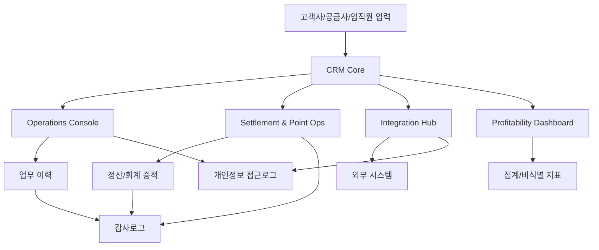

# Security & Compliance Baseline

## 1. 목적

이 스펙은 이제너두 전사 CRM OS MVP의 보안·컴플라이언스 구현 기준선이다. RBAC, 테넌트 격리, 개인정보 접근로그, 감사로그, 보존정책, 개인정보 흐름, 위험-통제 매핑을 개발과 QA가 검증 가능한 요구사항으로 정리한다.

개인정보/민감정보 항목, 처리범위, 보관기간, 외부 연동 전송 범위, 아키텍처는 본 스펙에서 확정하지 않으며 PM 승인 필요로 둔다.

인당 생산성/마진 기여: 구현 기준을 명확히 해 보안 요구 누락으로 인한 재개발과 감사 대응 수작업을 줄인다.

## 2. 입력

| 입력 | 설명 |
|---|---|
| `/docs/PRD.md` | MVP P0 Security & Audit Baseline 기준 |
| `/docs/SECURITY_A7_DRAFT.md` | A7 보안/컴플라이언스 초안 |
| ISMS 요구 | 접근통제, 로그관리, 개인정보 보호, 운영보안 통제 기준 |
| 개인정보 보호 요구 | 최소수집, 목적 제한, 접근기록, 보존/파기, 위탁 관리 |
| 외감 대응 요구 | 정산/회계 근거, 승인, 변경 이력, 증적 보존 |

인당 생산성/마진 기여: 구현팀이 같은 입력을 기준으로 판단하게 해 중복 질의와 재해석 비용을 줄인다.

## 3. 출력

| 출력 | 설명 |
|---|---|
| 권한 매트릭스 | 역할별 허용/거부/승인 필요 권한 |
| 테넌트 격리 규칙 | API, 화면, 데이터 조회의 기본 범위 조건 |
| 접근로그 스키마 | 개인정보 접근 이벤트 기록 필드 |
| 감사로그 스키마 | 업무 변경, 승인, 정산, 연동 이벤트 기록 필드 |
| 보존정책 표 | 데이터 유형별 보존/파기/승인 필요 상태 |
| 위험-통제 매핑 | 위험, 통제, 증적, 담당, 상태 |

인당 생산성/마진 기여: 산출물을 개발·QA·감사 준비에 재사용해 문서와 구현 간 간극을 줄인다.

## 4. 담당

| 영역 | 담당 |
|---|---|
| 스펙 작성 | A7 |
| 승인 | PM 김권일 |
| 인증/인가 구현 연계 | A1 |
| 운영 콘솔 구현 연계 | A2 |
| 정산/회계 증적 연계 | A4, A6 |
| 테스트/감사 검증 | A9 |

인당 생산성/마진 기여: 담당을 모듈별로 분리해 병렬 구현과 검증 속도를 높인다.

## 5. 공통 원칙

### S-01. 최소권한

- 사용자는 업무 수행에 필요한 최소 권한만 가진다.
- 권한은 사용자 직접 부여보다 역할 기반 부여를 우선한다.
- 임시 권한은 만료 시각과 승인 ID를 가져야 한다.

인당 생산성/마진 기여: 불필요한 권한 정리와 사고 조사 비용을 줄인다.

### S-02. 기본 테넌트 제한

- 모든 조회, 변경, 다운로드, 집계는 기본적으로 `tenant_scope`를 평가해야 한다.
- 전사 조회는 별도 승인 권한 또는 집계/비식별 지표에 한정한다.
- API는 클라이언트가 전달한 테넌트 조건만 신뢰하지 않고 서버에서 범위를 재계산해야 한다.

인당 생산성/마진 기여: 테넌트 조건을 공통화해 화면/API별 중복 구현과 누락 리스크를 줄인다.

### S-03. 로그 우선 설계

- 개인정보 접근과 주요 업무 변경은 기능 릴리스 전 로그 요건을 충족해야 한다.
- 로그 실패 시 개인정보 반출, 마스킹 해제, 권한 변경, 정산 확정은 실패 또는 보류 처리한다.
- 로그 조회 권한은 업무 데이터 변경 권한과 분리한다.

인당 생산성/마진 기여: 로그 누락으로 인한 사후 보완과 수기 증적 복구 비용을 예방한다.

### S-04. 승인 게이트

- 개인정보/민감정보 항목과 처리범위는 PM 승인 전 구현 확정 금지다.
- 민감정보 포함 가능성이 있는 기능은 `PM 승인 필요` 상태로 관리한다.
- 외부 전송, 다운로드, 보존기간, break-glass는 승인 ID를 요구한다.

인당 생산성/마진 기여: 승인 없는 범위 확장과 그에 따른 개발 폐기 비용을 줄인다.

## 6. RBAC 권한 매트릭스 초안

| 기능 | ExecutiveViewer | SalesAM | OpsAgent | SettlementOperator | FinanceAuditor | SecurityPrivacyOfficer | SystemAdmin | BreakGlassAdmin |
|---|---|---|---|---|---|---|---|---|
| 수익성 집계 조회 | 허용 | 제한 | 제한 | 제한 | 허용 | 제한 | 거부 | 제한 |
| 고객사 상세 조회 | 제한 | 담당 범위 | 업무 범위 | 제한 | 제한 | 제한 | 거부 | 승인 필요 |
| 임직원 개인정보 상세 조회 | 거부 | 거부 기본 | 업무 범위 승인 | 제한 승인 | 거부 기본 | 로그 검토 목적 제한 | 거부 | 승인 필요 |
| 운영 업무 상태 변경 | 거부 | 제한 | 허용 | 제한 | 거부 | 거부 | 거부 | 승인 필요 |
| 포인트/정산 변경 | 거부 | 거부 | 제한 | 허용 | 거부 | 거부 | 거부 | 승인 필요 |
| 정산/회계 증적 조회 | 제한 | 거부 | 제한 | 허용 | 허용 | 제한 | 거부 | 승인 필요 |
| 개인정보 접근로그 조회 | 거부 | 거부 | 거부 | 거부 | 제한 | 허용 | 거부 | 승인 필요 |
| 감사로그 조회 | 제한 | 제한 | 제한 | 제한 | 허용 | 허용 | 제한 | 승인 필요 |
| 권한 변경 | 거부 | 거부 | 거부 | 거부 | 거부 | 검토 | 설정 가능 | 승인 필요 |
| CSV/Excel 다운로드 | 제한 | 승인 필요 | 승인 필요 | 승인 필요 | 승인 필요 | 승인 필요 | 거부 | 승인 필요 |

`SupplierUser`, `CustomerAdmin`의 외부 사용자 권한 범위는 PM 승인 필요.

인당 생산성/마진 기여: 권한 매트릭스를 기준으로 화면 노출과 API 검증을 동시에 설계해 권한 관련 결함을 줄인다.

## 7. 테넌트 격리 요구사항

| ID | 요구사항 | 인수조건 |
|---|---|---|
| TEN-01 | 모든 업무 데이터는 `tenant_scope`를 가진다. | 고객사/공급사/전사/업무배정 범위 중 하나로 해석 가능해야 한다. |
| TEN-02 | 서버는 인증된 사용자 권한으로 허용 테넌트 범위를 계산한다. | 임의 `customer_company_id` 변경 요청으로 타 고객사 데이터를 조회할 수 없어야 한다. |
| TEN-03 | 목록, 상세, 검색, 다운로드에 동일한 테넌트 제한을 적용한다. | 같은 사용자에게 화면과 다운로드 결과의 범위가 일치해야 한다. |
| TEN-04 | 집계 대시보드는 기본적으로 비식별/집계 데이터를 사용한다. | 개인정보 상세 드릴다운은 별도 권한과 접근로그를 요구해야 한다. |
| TEN-05 | 전사 관리자 또는 긴급 접근은 예외 접근으로 기록한다. | 예외 접근은 승인 ID, 사유, 만료시각, 사후 검토 상태를 가져야 한다. |

인당 생산성/마진 기여: 격리 요구를 테스트 가능한 조건으로 만들어 운영 확대 시 고객사별 커스텀 통제를 줄인다.

## 8. 개인정보 접근로그 요구사항

| ID | 이벤트 | 필수 기록 |
|---|---|---|
| PAL-01 | 개인정보 상세 조회 | 사용자, 역할, 테넌트, 대상, 목적, 시각, 결과 |
| PAL-02 | 검색 결과 개인정보 노출 | 검색 조건, 결과 수, 마스킹 여부 |
| PAL-03 | 다운로드/반출 | 파일 유형, 건수, 사유, 승인 ID |
| PAL-04 | 마스킹 해제 | 해제 필드, 사유, 승인 ID |
| PAL-05 | 개인정보 수정/삭제/복구 | 변경 전/후 참조, 사유, 업무 ID |
| PAL-06 | 외부 연동 전송 | 연동 대상, 전송 항목, 결과, 재시도 ID |
| PAL-07 | 권한 상승 접근 | 권한 유형, 만료시각, 승인자, 사후 검토 상태 |

민감정보 필드, 마스킹 해제 대상, 다운로드 가능 항목은 PM 승인 필요.

인당 생산성/마진 기여: 접근로그 요건을 이벤트별로 고정해 개인정보 감사 대응과 이상 접근 분석을 자동화할 수 있다.

## 9. 감사로그 요구사항

| ID | 이벤트 | 필수 기록 |
|---|---|---|
| AUD-01 | 기준 데이터 생성/변경/삭제 | 대상, 변경 전/후, 행위자, 사유 |
| AUD-02 | 계약 상태 변경 | 계약 ID, 상태, 승인자, 관련 문서 |
| AUD-03 | 포인트 지급/차감/보정 | 금액/포인트, 사유, 승인 ID, 정산 참조 |
| AUD-04 | 정산 확정/보류/반려 | 정산 ID, 상태, 근거, 승인자 |
| AUD-05 | 운영 업무 상태 변경 | case ID, 이전/다음 상태, 담당자, SLA 영향 |
| AUD-06 | 외부 연동 실패/재시도/수동 보정 | 요청 ID, 멱등 키, 실패 사유, 처리자 |
| AUD-07 | 권한 변경 | 대상 사용자, 이전/다음 역할, 승인 ID |
| AUD-08 | 로그/보존정책 설정 변경 | 설정 전/후, 변경자, 승인 ID |

외감 제출 대상 이벤트와 보존기간은 PM 승인 필요.

인당 생산성/마진 기여: 업무 이벤트와 외감 증적을 연결해 정산 오류 조사와 감사 대응 리드타임을 줄인다.

## 10. 보존정책 요구사항

| ID | 데이터 유형 | 정책 | 상태 |
|---|---|---|---|
| RET-01 | 개인정보 원본 | 목적별 최소 보관, 만료 후 파기 또는 비식별화 | PM 승인 필요 |
| RET-02 | 민감정보 원본 | 처리 여부와 보관 필요성부터 승인 | PM 승인 필요 |
| RET-03 | 개인정보 접근로그 | 업무 데이터와 분리 보관, 위변조 방지 | PM 승인 필요 |
| RET-04 | 감사로그 | 삭제 제한, 무결성 검증, 장기 보존 후보 | PM 승인 필요 |
| RET-05 | 정산/회계 증적 | 외감/회계 기준에 따른 보존 | PM 승인 필요 |
| RET-06 | 운영 업무 이력 | 개인정보 분리 후 생산성 분석에 활용 가능 | PM 승인 필요 |
| RET-07 | 다운로드 파일 | 자동 만료, 재다운로드 통제, 반출 로그 연계 | PM 승인 필요 |

인당 생산성/마진 기여: 데이터 유형별 보존 결정을 분리해 저장비와 법적 리스크를 동시에 낮춘다.

## 11. 개인정보 흐름도

| 구간 | 통제 | 승인 필요 |
|---|---|---|
| 입력 -> CRM Core | 최소 수집, 암호화, 테넌트 키 부여 | 개인정보 항목 |
| CRM Core -> Operations Console | RBAC, 업무 배정 범위, 마스킹 | 민감정보 노출 여부 |
| CRM Core -> Settlement & Point Ops | 정산 권한 분리, 변경 감사로그 | 회계 증적 범위 |
| CRM Core -> Integration Hub -> 외부 시스템 | 전송 최소화, 연동 로그, 위탁 검토 | 전송 항목, 위탁/제3자 제공 |
| CRM/Ops/Settlement -> Dashboard | 집계/비식별화, 상세 접근 제한 | 드릴다운 범위 |
| 업무/연동/정산 -> 로그 | 로그 분리, 무결성, 보존정책 | 보존기간 |

인당 생산성/마진 기여: 데이터 이동 경로별 통제를 정의해 신규 기능 추가 시 보안 검토 시간을 줄인다.

## 12. 위험-통제 매핑

| 위험 ID | 위험 | 통제 ID | 통제 | 증적 |
|---|---|---|---|---|
| R-01 | 타 고객사 데이터 조회 | TEN-01~05 | 서버 기준 테넌트 제한, 예외 접근 기록 | 권한 테스트 결과, 접근로그 |
| R-02 | 개인정보 과다 조회 | PAL-01~07 | 목적 기반 접근, 마스킹, 접근로그 | 접근로그, 이상 조회 리포트 |
| R-03 | 민감정보 범위 오판 | S-04 | PM 승인 게이트 | 승인 기록 |
| R-04 | 정산 변경 증적 부족 | AUD-03~04 | 변경 전/후, 승인 ID, 정산 참조 기록 | 감사로그, 정산 증적 |
| R-05 | 권한 오남용 | S-01, AUD-07 | 최소권한, 권한 변경 감사 | 권한 매트릭스, 변경 로그 |
| R-06 | 외부 연동 개인정보 과전송 | PAL-06 | 전송 항목 기록, 위탁 검토 | 연동 스펙, 전송 로그 |
| R-07 | 로그 누락 | S-03 | 로그 실패 시 고위험 작업 보류 | 로그 실패 리포트 |
| R-08 | 로그 위변조 | RET-03~04 | 삭제 제한, 무결성 검증 | 무결성 리포트 |
| R-09 | 보존기간 초과 | RET-01~07 | 보존정책, 파기 이력 | 파기 로그 |
| R-10 | 대량 다운로드 유출 | PAL-03 | 반출 승인, 건수 기록, 사유 입력 | 다운로드 로그 |

인당 생산성/마진 기여: 위험과 통제를 ID로 연결해 QA와 감사 준비를 체크리스트화한다.

## 13. 인수조건

| ID | 인수조건 |
|---|---|
| AC-01 | 역할별 권한 매트릭스가 존재하고 개인정보/정산/로그/다운로드 권한이 분리되어야 한다. |
| AC-02 | 모든 핵심 데이터 접근은 서버 계산 `tenant_scope`를 통해 제한되어야 한다. |
| AC-03 | 개인정보 상세 조회, 검색 노출, 다운로드, 마스킹 해제는 접근로그를 남겨야 한다. |
| AC-04 | 계약, 포인트, 정산, 운영 업무, 권한 변경, 외부 연동 재처리는 감사로그를 남겨야 한다. |
| AC-05 | 로그 실패 시 개인정보 반출, 마스킹 해제, 권한 변경, 정산 확정은 실패 또는 보류되어야 한다. |
| AC-06 | 개인정보 흐름도와 위험-통제 매핑이 최신 스펙에 포함되어야 한다. |
| AC-07 | 민감정보 항목과 처리범위는 확정하지 않고 `PM 승인 필요`로 표시되어야 한다. |
| AC-08 | 보존기간, 파기 방식, 외부 전송 항목은 PM 승인 전 확정하지 않아야 한다. |

인당 생산성/마진 기여: 명확한 인수조건으로 보안 검증을 자동화 후보로 만들고 반복 검토 시간을 줄인다.

## 14. 의존성

| 의존성 | 필요 내용 | 상태 |
|---|---|---|
| 개인정보 항목 | 수집/이용/보관/반출 필드 | PM 승인 필요 |
| 민감정보 여부 | 민감정보 포함 여부와 처리 목적 | PM 승인 필요 |
| 인증/인가 아키텍처 | SSO, 세션, 토큰, 권한 평가 방식 | PM 승인 필요 |
| 로그 저장 아키텍처 | 저장소, 암호화, 무결성, 검색 방식 | PM 승인 필요 |
| 외부 연동 | 전송 항목, 위탁/제3자 제공, 실패 처리 | PM 승인 필요 |
| 외감 기준 | 증적 범위, 보존기간, 제출 형식 | PM 승인 필요 |
| QA 자동화 | 권한/테넌트/로그 테스트 방식 | A9 연계 필요 |

인당 생산성/마진 기여: 의존성을 승인 항목으로 분리해 MVP 구현팀이 불확실한 영역을 임의 확정하지 않게 한다.

## 15. KPI 영향

| KPI | 측정 방향 |
|---|---|
| 권한 요청 처리시간 | 역할 기반 승인 흐름 도입 전후 비교 |
| 감사 대응 리드타임 | 증적 요청부터 제출까지 소요시간 |
| 개인정보 접근 이상 탐지 시간 | 이상 조회 발생부터 식별까지 소요시간 |
| 정산 오류 조사 시간 | 정산 이벤트 추적 소요시간 |
| 운영자 1인당 처리 건수 | 권한 확인/증적 수집 자동화 후 처리량 |
| 보안 재작업 건수 | MVP 이후 보안 보완 이슈 수 |

인당 생산성/마진 기여: 보안 스펙을 경영 KPI에 연결해 통제를 운영 효율과 리스크 비용 절감 수단으로 관리한다.
